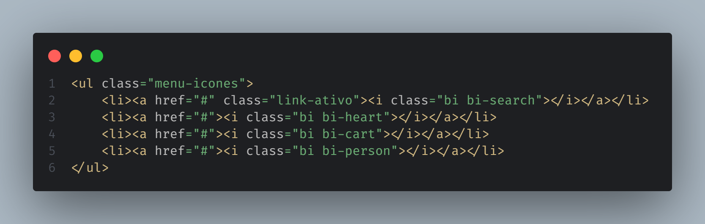

# Iniciativa Bootstrap
> aqui eu tenho um comentario

## um projeto do balacubaco
### outro projeto
#### aqui estou mais um dia
##### sobre olhar saguinario do vigia
###### salveee

Lorem Ipsum é simplesmente uma simulação de texto da indústria tipográfica e de impressos, e vem sendo utilizado desde o século XVI, quando um impressor desconhecido pegou uma bandeja de tipos e os embaralhou para fazer um livro de modelos de tipos. 

Lorem Ipsum sobreviveu não só a cinco séculos, como também ao salto para a editoração eletrônica, permanecendo essencialmente inalterado. Se popularizou na década de 60, quando a Letraset lançou decalques contendo passagens de Lorem Ipsum, e mais recentemente quando passou a ser integrado a softwares de editoração eletrônica como Aldus PageMaker.

https://docs.github.com/pt/get-started/writing-on-github/getting-started-with-writing-and-formatting-on-github/basic-writing-and-formatting-syntax

[Link de Referencia MarkDown](https://docs.github.com/pt/get-started/writing-on-github/getting-started-with-writing-and-formatting-on-github/basic-writing-and-formatting-syntax)

> [!IMPORTANT]
> aqui eu tenho um texto importante

> [!IMPORTANT]
> Key information users need to know to achieve their goal.