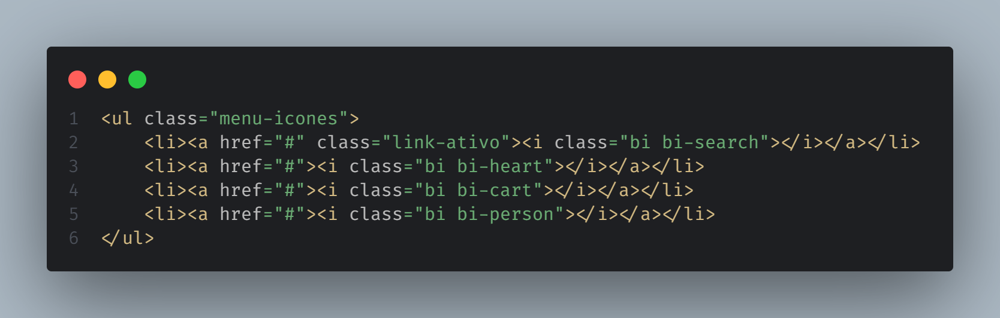

# Iniciativa Bootstrap
> aqui eu tenho um comentario

## um projeto do balacubaco
### outro projeto
#### aqui estou mais um dia
##### sobre olhar saguinario do vigia
###### salveee

## Topicos importantes do meu projeto

- topico 1
    - topico 2
    - topico 2
    - topico 2
- topico 3
- topico 3
- topico 3
- topico 3
- topico 3

1. topico com numero
    - topico com numero 2
1. topico com numero 3
1. topico com numero 4
1. topico com numero 5

- [x] teste
    - [ ] teste
- [x] teste
- [ ] teste

```html
<ul class="menu-icones">
    <li><a href="#" class="link-ativo"><i class="bi bi-search"></i></a></li>
    <li><a href="#"><i class="bi bi-heart"></i></a></li>
    <li><a href="#"><i class="bi bi-cart"></i></a></li>
    <li><a href="#"><i class="bi bi-person"></i></a></li>
</ul>
```

Lorem Ipsum é simplesmente uma simulação de texto da indústria tipográfica e de impressos, e vem sendo utilizado desde o século XVI, quando um impressor desconhecido pegou uma bandeja de tipos e os embaralhou para fazer um livro de modelos de tipos. 

Lorem Ipsum sobreviveu não só a cinco séculos, como também ao salto para a editoração eletrônica, permanecendo essencialmente inalterado. Se popularizou na década de 60, quando a Letraset lançou decalques contendo passagens de Lorem Ipsum, e mais recentemente quando passou a ser integrado a softwares de editoração eletrônica como Aldus PageMaker.


https://docs.github.com/pt/get-started/writing-on-github/getting-started-with-writing-and-formatting-on-github/basic-writing-and-formatting-syntax

[Link de Referencia MarkDown](https://docs.github.com/pt/get-started/writing-on-github/getting-started-with-writing-and-formatting-on-github/basic-writing-and-formatting-syntax)




> [!IMPORTANT]
> aqui eu tenho um texto importante


> [!IMPORTANT]
> Key information users need to know to achieve their goal.